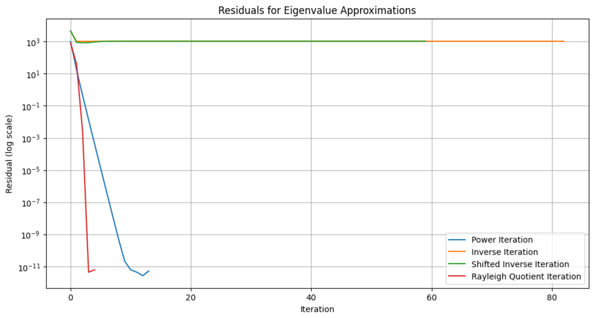

# Iterative Methods for Eigenvalues and Eigenvectors

A comprehensive implementation of numerical iterative methods for computing eigenvalues and eigenvectors of real matrices, based on Maysum Panju's paper "Iterative Methods for Computing Eigenvalues and Eigenvectors".

## Overview

This repository provides implementations of five fundamental iterative methods for eigenvalue computation:

1. **Power Iteration**: Finds the eigenvector corresponding to the largest eigenvalue
2. **Inverse Iteration with Shift**: Extends power iteration to find any eigenvalue with an initial approximation
3. **Rayleigh Quotient Iteration (RQI)**: Improves inverse iteration using dynamic shift updates
4. **Simultaneous Iteration**: Multi-vector extension for computing multiple eigenvalues
5. **QR Iteration**: Comprehensive algorithm for all eigenvalues and eigenvectors

## Requirements

- Python 3.x
- NumPy (for matrix operations)
- Matplotlib (optional, for visualizations)

Install dependencies using:
```bash
pip install numpy matplotlib
```

## Project Structure

- `simulations_iterative_methods_for__eigenvales.ipynb`: Main Jupyter notebook with implementations and examples
- `researchpaper_iterative_methods_for _eigenvales.pdf`: Reference paper with theoretical foundations

## Key Methods

### Power Iteration
- Input: Matrix A and iteration count
- Output: Dominant eigenvector
- Application: Finding largest eigenvalue

### Inverse Iteration with Shift
- Key concept: Solves (A−μI)x=b
- Application: Finding eigenvalues near a given approximation

### Rayleigh Quotient Iteration
- Feature: Cubic convergence
- Application: Fast convergence to nearby eigenvalue

### Simultaneous Iteration
- Technique: QR factorization at each step
- Application: Multiple eigenvalue computation

### QR Iteration
- Process: Iterative QR decomposition
- Application: Complete eigenvalue/eigenvector computation

## Results:


## References

- Maysum Panju, "Iterative Methods for Computing Eigenvalues and Eigenvectors", The Waterloo Mathematics Review
- Various numerical methods and linear algebra lecture materials

## License

MIT License